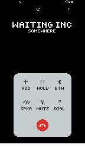
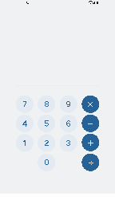
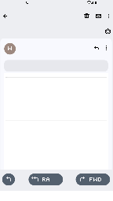
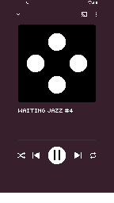
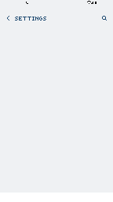
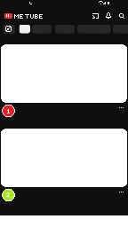
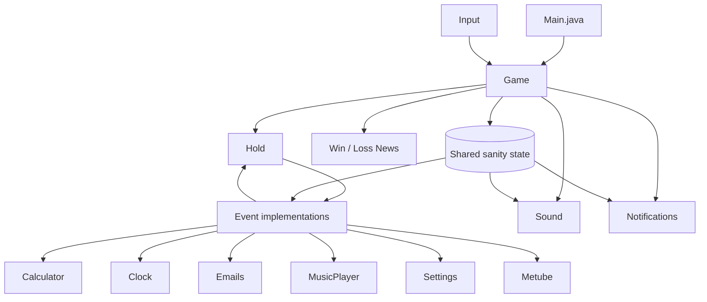

# Please Hold

**A surreal desktop puzzle game about surviving the world's worst customer-support call without losing your sanity.**

Built in approximately **72 hours** for **GUDEV Game Jam 16** (Glasgow University Game Development Society) in **March 2026**, for the theme **Time**.

**Tech:** Java · Swing/AWT · Java Sound · Custom game loop · No external game engine

---

## Overview

**Please Hold** puts you on an increasingly strange support call with one simple objective: stay on the line long enough to get your problem solved.

While hold music plays, the support agent interrupts the call with a sequence of small tasks: memory tests, timing challenges, an email maze, a calculator puzzle, a settings puzzle, and even a suspicious video app. Every mistake can reduce your **sanity**, and the game actively becomes less trustworthy as that value falls.

Sanity is more than a health bar. It is shared game state that changes puzzle behaviour, interface reliability, notifications, audio cues, and difficulty across otherwise independent minigames.

The entire game was written directly against the Java standard desktop APIs rather than using Unity, Godot, LibGDX, or another game engine.

---

## Screens

| Hold screen | Calculator | Email maze |
| --- | --- | --- |
|  |  |  |

| Memory game | Settings puzzle | MeTube |
| --- | --- | --- |
|  |  |  |

---

## Technical Highlights

- **Custom update/render loop** running on its own game thread at roughly 31 FPS.
- **Virtual 144 × 256 phone display** rendered to an off-screen `BufferedImage` and scaled into the desktop UI, keeping the pixel-art interface at a fixed logical resolution.
- **Frameless transparent Swing window** with custom click handling, cursor feedback, entrance animation, and drag-to-move behaviour.
- **Coordinate transformation layer** that maps mouse input from the scaled desktop window back into the virtual phone coordinate system.
- **Modular event architecture** built around a common `Event` lifecycle: `start()`, `update()`, `render()` and `click()`.
- **Shared sanity system** that affects mechanics across multiple independent game modes instead of acting as a simple score or health value.
- **Procedural and state-dependent puzzle behaviour**, including generated toggle relationships, randomized task order, dynamic difficulty and low-sanity interference.
- **Graph-style email navigation** with cycles, dead ends, a back-stack and dynamically injected branches.
- **Layered audio system** using `javax.sound.sampled.Clip`, with separate hold/intermission, UI, memory-tone, normal, creepy and spooky sound pools.
- **Zero third-party runtime dependencies**: gameplay, rendering, input and audio are implemented with Java's standard libraries.

---

## Gameplay

The game alternates between the main **Hold** screen and a pool of support tasks. Completing a task advances the call, increases the stage, and eventually returns the player to hold before the next interruption.

| Event | What it does |
| --- | --- |
| **Hold** | Tracks call time, plays hold/intermission audio and acts as the hub between tasks. Hanging up ends the run. |
| **Calculator** | Reach randomized target values using only single-digit arithmetic. Lower sanity can remove controls or even alter the target. |
| **Clock** | Start and stop a rotating hand inside a target zone. The target tightens with progression and the hand accelerates as sanity falls. |
| **Email Maze** | Navigate a graph of linked support emails to find the solution. Repeated pages cost sanity and low sanity can inject extra misleading branches. |
| **Music Player** | A Simon-style memory challenge with four coloured inputs and matching audio tones. The sequence grows, and low sanity can rearrange the controls. |
| **Settings** | A generated toggle puzzle in which each setting can affect other settings through randomly assigned relationships. Enable everything to continue. |
| **MeTube** | A deliberately questionable video feed where each choice can improve or damage sanity. The available content is drawn without replacement. |
| **News** | Displays the final win or loss headline based on the outcome of the call. |

The order of the main support tasks is randomized, with a scripted MeTube interruption during the run. This keeps repeat playthroughs from following exactly the same sequence.

---

## Architecture



### Core engine

`engine.Game` owns the main game state, render buffer, stage progression, sanity, transitions, notifications, audio system and event scheduling. The logical phone display is drawn independently of the outer desktop frame and then scaled into place during `paintComponent()`.

`engine.Input` translates Swing mouse events into the logical phone coordinate space. This allows every minigame to work against the same small fixed-resolution coordinate system regardless of the size of the outer window.

`Events.Event` provides the common interface used by each minigame. Each event owns its local state and hitboxes while the central `Game` object handles shared state and transitions.

### Sanity as a system

The sanity value starts at 100 and is intentionally coupled to multiple systems. Depending on the event, losing sanity can:

- increase timing speed;
- remove calculator buttons;
- mutate calculator targets;
- inject misleading email branches;
- reshuffle memory-game colours;
- change support messages;
- alter ambient audio;
- trigger more unsettling UI behaviour.

That makes the game's difficulty progression emerge from one shared state variable rather than from isolated difficulty flags in each minigame.

---

## Project Structure

```text
PleaseHold/
├── src/
│   ├── Main.java                 # Application entry point
│   ├── engine/
│   │   ├── Game.java             # Main loop, rendering, state and transitions
│   │   ├── Input.java            # Mouse input and coordinate mapping
│   │   ├── Sound.java            # Java Sound clip management
│   │   ├── Button.java           # Shared interactive hitbox model
│   │   ├── Buttons.java          # Button actions / calculator values
│   │   ├── Email.java            # Email graph node model
│   │   ├── MetubeVid.java        # Video-entry data model
│   │   └── Notification.java     # Timed in-game notifications
│   ├── Events/
│   │   ├── Event.java            # Base event abstraction
│   │   ├── Hold.java
│   │   ├── Calculator.java
│   │   ├── Clock.java
│   │   ├── Emails.java
│   │   ├── MusicPlayer.java
│   │   ├── Settings.java
│   │   ├── Metube.java
│   │   └── News.java
│   └── assets/
│       ├── images/               # Pixel-art UI and faux video frames
│       └── sounds/               # Hold music, effects and adaptive audio
├── bin/                          # Compiled classes / copied assets from the jam build
└── .vscode/                      # VS Code Java project configuration
```

---

## Running Locally

### Requirements

- **Windows** is the currently supported platform for the original jam source.
- **JDK 21 or newer** is required by the source code. The original jam build was developed with **Java 25**.
- Audio output must be available for the full experience.

> The current source contains a few Windows-specific asset assumptions, including backslash-separated audio paths and case-insensitive image filename references. The underlying Swing/AWT code is portable, but the jam build should be treated as Windows-first unless those resource paths are normalized.

### 1. Get the repository

Using GitHub CLI:

```powershell
gh repo clone Daniel-Thomp/PleaseHold
cd PleaseHold
```

Alternatively, download the repository as a ZIP from GitHub and extract it.

### 2. Run from VS Code

1. Install a JDK (Java 21+).
2. Install the **Extension Pack for Java** in VS Code.
3. Open the repository root in VS Code.
4. Open `src/Main.java`.
5. Run the `Main` class.

Keep the repository root as the working directory because the jam build loads assets using paths relative to `src/`.

### 3. Run from PowerShell

From the repository root:

```powershell
$files = Get-ChildItem -Recurse src -Filter *.java | ForEach-Object { $_.FullName }
javac -d bin $files
java -cp bin Main
```

---

## Controls

The game is mouse-driven.

- **Left click** — interact with the phone UI and minigames.
- **Mouse movement** — highlights interactive areas with the hand cursor.
- **Click and drag** — move the frameless game window around the desktop.
- **Do not hang up** — unless you are prepared to accept the consequences.

Individual minigames explain themselves through the support agent's notifications and UI.

---

## Game Jam

**Please Hold** was created for **GUDEV Game Jam 16** in March 2026. GUDEV is the Glasgow University Game Development Society, and the jam's theme was **Time**.

The project was built in approximately **72 hours**, so the design deliberately favours a small reusable framework and composable minigames over a large engine or content pipeline. The theme appears throughout the experience: waiting on hold, a continuously increasing call timer, timed audio interruptions, a clock challenge, escalating pressure and the player's perception of how long the call has lasted.

---

## Jam-Build Limitations

This repository intentionally remains close to the original game-jam implementation. A few rough edges are therefore preserved:

- resource loading currently assumes Windows-style paths in places;
- some image references rely on Windows' case-insensitive filesystem;
- assets are loaded directly from the repository rather than packaged as classpath resources;
- the project uses the lightweight VS Code Java layout rather than Maven or Gradle;
- restarting from the end screen was not completed during the jam, so a new run requires relaunching the application.

For a longer-term release, the next engineering pass would move resources behind a platform-independent loader, package the application into a distributable build, add automated tests around game-state transitions, and formalize the build with Gradle or Maven.

---

## What I Learned

Building the game without an engine meant implementing the pieces that a game engine normally hides: a render/update loop, state transitions, coordinate transforms, input routing, audio playback, screen buffering and reusable scene-style abstractions.

The 72-hour constraint also made architecture matter. The shared `Event` interface allowed new minigames to be added without rewriting the core loop, while the global sanity system created interaction between otherwise separate mechanics. That combination made it possible to keep expanding the game while still shipping a complete jam entry on a very short deadline.

---

## Status

**Game-jam build — complete and playable.**

The repository is primarily preserved as the source for the March 2026 GUDEV Game Jam 16 entry and as a record of the custom Java implementation built during the jam.
